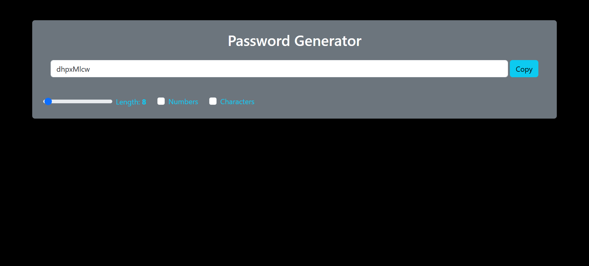

# Password Generator App

A simple and customizable password generator built with React. The app allows you to generate secure passwords based on user preferences such as length, inclusion of numbers, and special characters.

## Features

- Password Length: Customize the length of the password using a slider.
- Include Numbers: Toggle to include numbers in the generated password.
- Include Special Characters: Toggle to include special characters in the generated password.
- Password Copy: Easily copy the generated password with a click of a button.

## Installation

- Step 1: Clone the repository
  git clone https://github.com/your-username/password-generator-react.git

- Step 2: Navigate into the project directory
  cd password-generator-react

- Step 3: Install dependencies
  npm install

- Step 4: Start the development server
  npm start

## How to Use the App

- Password Length: Adjust the length of the generated password using the slider. The minimum length is 1 character, and you can increase it based on your requirements.
- Include Numbers: Check the "Numbers" checkbox if you want to include numbers in the generated password.
- Include Special Characters: Check the "Characters" checkbox to add special characters (e.g., !@#$%^&*) to your password.
- Generate Password: Click the "Generate Password" button to generate a new password based on the selected criteria.
- Copy Password: Use the "Copy" button to copy the generated password to your clipboard.

## App Structure

The project follows a basic structure that includes:

- src/App.js: The main component that handles the password generation logic and UI.
- src/App.css: Custom CSS for styling the app (you can modify this to change the UI/UX).
- public/index.html: The HTML file where the React app is injected.

## Technologies Used

- React: A JavaScript library for building user interfaces.
- Bootstrap: A front-end framework for building responsive layouts and styling.
- JavaScript (ES6+): Modern JavaScript for handling logic and state management.
- CSS: Used for custom styles and layout tweaks.

## Contributing

If you'd like to contribute to this project:

- Fork the repository
- Create a new branch (git checkout -b feature-name)
- Make your changes
- Commit your changes (git commit -am 'Add feature')
- Push to your branch (git push origin feature-name)
- Open a pull request

## Screenshots

To provide a better understanding of the Recipe Book application, here is a screenshot:

##Main Interface

